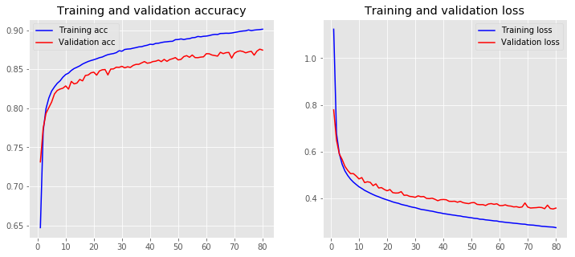

# OCR with Keras

#### Implementing Optical Character Recognition using Keras and comparing the results for multiple approaches
#### Deepti Gupta


```python
from keras.datasets import mnist
import matplotlib.pyplot as plt


```

    Using TensorFlow backend.
    


```python
import numpy as np
```

#### Load the MNIST dataset and plot 4 images as gray scale


```python
(X_train, y_train), (X_test, y_test) = mnist.load_data()

plt.subplot(221)
plt.imshow(X_train[0], cmap=plt.get_cmap('gray'))
plt.subplot(222)
plt.imshow(X_train[1], cmap=plt.get_cmap('gray'))
plt.subplot(223)
plt.imshow(X_train[2], cmap=plt.get_cmap('gray'))
plt.subplot(224)
plt.imshow(X_train[3], cmap=plt.get_cmap('gray'))

plt.show()
```


#### flatten 28*28 images to a 784 vector for each image


```python

num_pixels = X_train.shape[1] * X_train.shape[2]
X_train = X_train.reshape(X_train.shape[0], num_pixels)
X_test = X_test.reshape(X_test.shape[0], num_pixels)

```

#### normalize inputs from 0-255 to 0-1


```python
X_train = X_train / 255
X_test = X_test / 255
```

#### Convert the Y (0-9 target values) into categorical values 


```python
Y_test = y_test 
from keras.utils import np_utils
# one hot encode outputs
y_train = np_utils.to_categorical(y_train)
y_test = np_utils.to_categorical(y_test)
num_classes = y_test.shape[1]    #10 classes

```

#### Next step is to build the model
Sequential starts to make the model. The Sequential model API is a way of creating deep learning models where an instance of the Sequential class is created and model layers are created and added to it. 

We can add layers by .add() function. 

And dense() will give the information about that layer.

Finally compile() will define the type of loss function, and output


### Approach 1 : Hidden Layer = 1, Nodes = 16, Epoch = 10


```python
from keras.models import Sequential
from keras.layers import Dense
#from keras import optimizers

hidden_layer_nodes=16
def baseline_model():
    # create model
    model = Sequential()
    model.add(Dense(num_pixels, input_dim=num_pixels, kernel_initializer='normal', activation='sigmoid'))
    model.add(Dense(hidden_layer_nodes, kernel_initializer='normal', activation='sigmoid'))
    model.add(Dense(num_classes, kernel_initializer='normal', activation='sigmoid'))
    #sgd = optimizers.SGD(lr=0.01, momentum=0.0, decay=0.0, nesterov=False)
    # Compile model
    #model.compile(loss='mean_squared_error', optimizer='adam', metrics=['accuracy'])
    model.compile(loss='mean_squared_error', optimizer='sgd', metrics=['accuracy'])
    return model

```


```python
model = baseline_model()
# Fit the model
nn_simple = model.fit(X_train, y_train, validation_data=(X_test, y_test), epochs=10, batch_size=200)
# Final evaluation of the model
scores = model.evaluate(X_test, y_test)
print("Baseline Error: %.2f%%" % (100-scores[1]*100))
print("Accuracy: %.2f%%" % (scores[1]*100))

```

    WARNING:tensorflow:From C:\Users\Deepti\Anaconda3\lib\site-packages\keras\backend\tensorflow_backend.py:74: The name tf.get_default_graph is deprecated. Please use tf.compat.v1.get_default_graph instead.
    
    WARNING:tensorflow:From C:\Users\Deepti\Anaconda3\lib\site-packages\keras\backend\tensorflow_backend.py:517: The name tf.placeholder is deprecated. Please use tf.compat.v1.placeholder instead.
    
    WARNING:tensorflow:From C:\Users\Deepti\Anaconda3\lib\site-packages\keras\backend\tensorflow_backend.py:4115: The name tf.random_normal is deprecated. Please use tf.random.normal instead.
    
    WARNING:tensorflow:From C:\Users\Deepti\Anaconda3\lib\site-packages\keras\optimizers.py:790: The name tf.train.Optimizer is deprecated. Please use tf.compat.v1.train.Optimizer instead.
    
    WARNING:tensorflow:From C:\Users\Deepti\Anaconda3\lib\site-packages\keras\backend\tensorflow_backend.py:986: The name tf.assign_add is deprecated. Please use tf.compat.v1.assign_add instead.
    
    WARNING:tensorflow:From C:\Users\Deepti\Anaconda3\lib\site-packages\keras\backend\tensorflow_backend.py:973: The name tf.assign is deprecated. Please use tf.compat.v1.assign instead.
    
    Train on 60000 samples, validate on 10000 samples
    Epoch 1/10
    60000/60000 [==============================] - 4s 66us/step - loss: 0.2213 - acc: 0.0975 - val_loss: 0.1901 - val_acc: 0.0974
    Epoch 2/10
    60000/60000 [==============================] - 3s 51us/step - loss: 0.1638 - acc: 0.0975 - val_loss: 0.1413 - val_acc: 0.0974
    Epoch 3/10
    60000/60000 [==============================] - 3s 51us/step - loss: 0.1272 - acc: 0.0975 - val_loss: 0.1163 - val_acc: 0.0974
    Epoch 4/10
    60000/60000 [==============================] - 3s 51us/step - loss: 0.1098 - acc: 0.0975 - val_loss: 0.1048 - val_acc: 0.0974
    Epoch 5/10
    60000/60000 [==============================] - 3s 55us/step - loss: 0.1017 - acc: 0.0983 - val_loss: 0.0991 - val_acc: 0.1030
    Epoch 6/10
    60000/60000 [==============================] - 4s 63us/step - loss: 0.0974 - acc: 0.1126 - val_loss: 0.0960 - val_acc: 0.1135
    Epoch 7/10
    60000/60000 [==============================] - 4s 66us/step - loss: 0.0950 - acc: 0.1124 - val_loss: 0.0941 - val_acc: 0.1135
    Epoch 8/10
    60000/60000 [==============================] - 3s 57us/step - loss: 0.0935 - acc: 0.1124 - val_loss: 0.0929 - val_acc: 0.1135
    Epoch 9/10
    60000/60000 [==============================] - 4s 66us/step - loss: 0.0925 - acc: 0.1124 - val_loss: 0.0921 - val_acc: 0.1135
    Epoch 10/10
    60000/60000 [==============================] - 4s 68us/step - loss: 0.0919 - acc: 0.1124 - val_loss: 0.0916 - val_acc: 0.1135
    10000/10000 [==============================] - 0s 44us/step
    Baseline Error: 88.65%
    Accuracy: 11.35%
    

#### Evaluate the model


```python
plt.subplot(2,1,1)
plt.plot(nn_simple.history['acc'])
plt.plot(nn_simple.history['val_acc'])
plt.title('model accuracy')
plt.ylabel('accuracy')
plt.xlabel('epoch')
plt.legend(['train', 'test'], loc='lower right')

plt.subplot(2,1,2)
plt.plot(nn_simple.history['loss'])
plt.plot(nn_simple.history['val_loss'])
plt.title('model loss')
plt.ylabel('loss')
plt.xlabel('epoch')
plt.legend(['train', 'test'], loc='upper right')

plt.show()

```





#### Check the performance of the model graphically


```python
predicted_classes = model.predict_classes(X_test)
# see which we predicted correctly and which not
correct_indices = np.nonzero(predicted_classes == Y_test)[0]
incorrect_indices = np.nonzero(predicted_classes != Y_test)[0]
print()
print(len(correct_indices),"classified correctly")
print(len(incorrect_indices),"classified incorrectly")
# adapt figure size to accomodate 18 subplots
plt.rcParams['figure.figsize'] = (7,14)
figure_evaluation = plt.figure()
# plot 9 correct predictions
for i, correct in enumerate(correct_indices[:9]):
    plt.subplot(6,3,i+1)
    plt.imshow(X_test[correct].reshape(28,28), cmap='gray', interpolation='none')
    plt.title(
      "Predicted: {}, Truth: {}".format(predicted_classes[correct],
                                        Y_test[correct]))
    plt.xticks([])
    plt.yticks([])
```

    
    1135 classified correctly
    8865 classified incorrectly
    


#### Result: Approach 1
#### Hidden Layers = 1, Nodes = 16, Epoch = 10, Batch size = 200
#### Baseline Error: 94.81% , Accuracy: 5.19%
#### Prediction Result : 1135 classified correctly, 8865 classified incorrectly
#### Accuracy graph predicts that it is going down with the increase in epochs

### Approach 2 : Hidden Layers = 1, Nodes = 16, Epoch = 20


```python
model2 = baseline_model()
# Fit the model
nn_simple_2 = model2.fit(X_train, y_train, validation_data=(X_test, y_test), epochs=20, batch_size=200)
# Final evaluation of the model
scores = model2.evaluate(X_test, y_test)
print("Baseline Error: %.2f%%" % (100-scores[1]*100))
print("Accuracy: %.2f%%" % (scores[1]*100))

```

    Train on 60000 samples, validate on 10000 samples
    Epoch 1/20
    60000/60000 [==============================] - 3s 55us/step - loss: 0.2297 - acc: 0.0991 - val_loss: 0.2022 - val_acc: 0.1009
    Epoch 2/20
    60000/60000 [==============================] - 3s 54us/step - loss: 0.1765 - acc: 0.0991 - val_loss: 0.1529 - val_acc: 0.1009
    Epoch 3/20
    60000/60000 [==============================] - 3s 51us/step - loss: 0.1364 - acc: 0.0992 - val_loss: 0.1230 - val_acc: 0.1009
    Epoch 4/20
    60000/60000 [==============================] - 3s 51us/step - loss: 0.1148 - acc: 0.0992 - val_loss: 0.1083 - val_acc: 0.1009
    Epoch 5/20
    60000/60000 [==============================] - 5s 76us/step - loss: 0.1043 - acc: 0.0991 - val_loss: 0.1010 - val_acc: 0.1010
    Epoch 6/20
    60000/60000 [==============================] - 3s 52us/step - loss: 0.0989 - acc: 0.1024 - val_loss: 0.0971 - val_acc: 0.1152
    Epoch 7/20
    60000/60000 [==============================] - 5s 79us/step - loss: 0.0959 - acc: 0.1518 - val_loss: 0.0948 - val_acc: 0.1604
    Epoch 8/20
    60000/60000 [==============================] - 7s 109us/step - loss: 0.0941 - acc: 0.1294 - val_loss: 0.0934 - val_acc: 0.1155
    Epoch 9/20
    60000/60000 [==============================] - 4s 64us/step - loss: 0.0929 - acc: 0.1126 - val_loss: 0.0925 - val_acc: 0.1135
    Epoch 10/20
    60000/60000 [==============================] - 5s 82us/step - loss: 0.0921 - acc: 0.1124 - val_loss: 0.0918 - val_acc: 0.1135
    Epoch 11/20
    60000/60000 [==============================] - 5s 83us/step - loss: 0.0916 - acc: 0.1124 - val_loss: 0.0914 - val_acc: 0.1135
    Epoch 12/20
    60000/60000 [==============================] - 6s 92us/step - loss: 0.0912 - acc: 0.1124 - val_loss: 0.0911 - val_acc: 0.1135
    Epoch 13/20
    60000/60000 [==============================] - 3s 52us/step - loss: 0.0909 - acc: 0.1124 - val_loss: 0.0908 - val_acc: 0.1135
    Epoch 14/20
    60000/60000 [==============================] - 5s 76us/step - loss: 0.0907 - acc: 0.1124 - val_loss: 0.0906 - val_acc: 0.1135
    Epoch 15/20
    60000/60000 [==============================] - 5s 76us/step - loss: 0.0906 - acc: 0.1124 - val_loss: 0.0905 - val_acc: 0.1135
    Epoch 16/20
    60000/60000 [==============================] - 5s 78us/step - loss: 0.0904 - acc: 0.1124 - val_loss: 0.0904 - val_acc: 0.1135
    Epoch 17/20
    60000/60000 [==============================] - 6s 100us/step - loss: 0.0904 - acc: 0.1124 - val_loss: 0.0903 - val_acc: 0.1135
    Epoch 18/20
    60000/60000 [==============================] - 8s 138us/step - loss: 0.0903 - acc: 0.1124 - val_loss: 0.0902 - val_acc: 0.1135
    Epoch 19/20
    60000/60000 [==============================] - 5s 91us/step - loss: 0.0902 - acc: 0.1124 - val_loss: 0.0902 - val_acc: 0.1135
    Epoch 20/20
    60000/60000 [==============================] - 5s 83us/step - loss: 0.0902 - acc: 0.1124 - val_loss: 0.0901 - val_acc: 0.1135
    10000/10000 [==============================] - 0s 47us/step
    Baseline Error: 88.65%
    Accuracy: 11.35%
    


```python
plt.subplot(2,1,1)
plt.plot(nn_simple_2.history['acc'])
plt.plot(nn_simple_2.history['val_acc'])
plt.title('model accuracy')
plt.ylabel('accuracy')
plt.xlabel('epoch')
plt.legend(['train', 'test'], loc='lower right')

plt.subplot(2,1,2)
plt.plot(nn_simple_2.history['loss'])
plt.plot(nn_simple_2.history['val_loss'])
plt.title('model loss')
plt.ylabel('loss')
plt.xlabel('epoch')
plt.legend(['train', 'test'], loc='upper right')

plt.show()

```


#### Result: Approach 2
#### Hidden Layers = 1, Nodes = 16, Epoch = 20, Batch size = 200
#### Baseline Error: 88.65% , Accuracy: 11.35%

#### Appraoch 1 and 2 has same baseline error and accuracy because we are using the same model but increasing the epochs can lead to decrease in accuracy for training and testing models 


### Approach 3 : Hidden Layers = 1, Nodes = 32, Epoch = 10


```python

hidden_layer_nodes_32 = 32

# NN_model_1_32 signifies Neural network model with 1 layer and 32 perceptrons
def NN_model_1_32():
    # create model
    model = Sequential()
    model.add(Dense(num_pixels, input_dim=num_pixels, kernel_initializer='normal', activation='sigmoid'))
    model.add(Dense(hidden_layer_nodes_32, kernel_initializer='normal', activation='sigmoid'))
    model.add(Dense(num_classes, kernel_initializer='normal', activation='sigmoid'))
    #sgd = optimizers.SGD(lr=0.01, momentum=0.0, decay=0.0, nesterov=False)
    # Compile model
    #model.compile(loss='mean_squared_error', optimizer='adam', metrics=['accuracy'])
    model.compile(loss='mean_squared_error', optimizer='sgd', metrics=['accuracy'])
    return model

```


```python
model2 = NN_model_1_32()
# Fit the model
nn_model_1_32 = model2.fit(X_train, y_train, validation_data=(X_test, y_test), epochs=20, batch_size=200)
# Final evaluation of the model
scores = model2.evaluate(X_test, y_test)
print("Baseline Error: %.2f%%" % (100-scores[1]*100))
print("Accuracy: %.2f%%" % (scores[1]*100))

```

    Train on 60000 samples, validate on 10000 samples
    Epoch 1/20
    60000/60000 [==============================] - 5s 81us/step - loss: 0.1964 - acc: 0.0972 - val_loss: 0.1550 - val_acc: 0.1056
    Epoch 2/20
    60000/60000 [==============================] - 5s 82us/step - loss: 0.1322 - acc: 0.1116 - val_loss: 0.1158 - val_acc: 0.1050
    Epoch 3/20
    60000/60000 [==============================] - 6s 94us/step - loss: 0.1077 - acc: 0.1078 - val_loss: 0.1017 - val_acc: 0.1031
    Epoch 4/20
    60000/60000 [==============================] - 6s 93us/step - loss: 0.0985 - acc: 0.1057 - val_loss: 0.0961 - val_acc: 0.1262
    Epoch 5/20
    60000/60000 [==============================] - 5s 90us/step - loss: 0.0946 - acc: 0.1356 - val_loss: 0.0935 - val_acc: 0.1252
    Epoch 6/20
    60000/60000 [==============================] - 5s 79us/step - loss: 0.0927 - acc: 0.1167 - val_loss: 0.0921 - val_acc: 0.1138
    Epoch 7/20
    60000/60000 [==============================] - 6s 98us/step - loss: 0.0917 - acc: 0.1127 - val_loss: 0.0913 - val_acc: 0.1135
    Epoch 8/20
    60000/60000 [==============================] - 5s 82us/step - loss: 0.0911 - acc: 0.1124 - val_loss: 0.0909 - val_acc: 0.1135
    Epoch 9/20
    60000/60000 [==============================] - 3s 58us/step - loss: 0.0907 - acc: 0.1124 - val_loss: 0.0906 - val_acc: 0.1135
    Epoch 10/20
    60000/60000 [==============================] - 5s 80us/step - loss: 0.0905 - acc: 0.1124 - val_loss: 0.0904 - val_acc: 0.1135
    Epoch 11/20
    60000/60000 [==============================] - 5s 88us/step - loss: 0.0903 - acc: 0.1124 - val_loss: 0.0903 - val_acc: 0.1135
    Epoch 12/20
    60000/60000 [==============================] - 6s 96us/step - loss: 0.0902 - acc: 0.1124 - val_loss: 0.0902 - val_acc: 0.1135
    Epoch 13/20
    60000/60000 [==============================] - 5s 79us/step - loss: 0.0901 - acc: 0.1124 - val_loss: 0.0901 - val_acc: 0.1135
    Epoch 14/20
    60000/60000 [==============================] - 5s 82us/step - loss: 0.0901 - acc: 0.1124 - val_loss: 0.0901 - val_acc: 0.1135
    Epoch 15/20
    60000/60000 [==============================] - 6s 98us/step - loss: 0.0900 - acc: 0.1124 - val_loss: 0.0900 - val_acc: 0.1135
    Epoch 16/20
    60000/60000 [==============================] - 4s 65us/step - loss: 0.0900 - acc: 0.1124 - val_loss: 0.0900 - val_acc: 0.1135
    Epoch 17/20
    60000/60000 [==============================] - 7s 113us/step - loss: 0.0900 - acc: 0.1124 - val_loss: 0.0900 - val_acc: 0.1135
    Epoch 18/20
    60000/60000 [==============================] - 5s 81us/step - loss: 0.0900 - acc: 0.1124 - val_loss: 0.0900 - val_acc: 0.1135
    Epoch 19/20
    60000/60000 [==============================] - 5s 81us/step - loss: 0.0900 - acc: 0.1124 - val_loss: 0.0900 - val_acc: 0.1135
    Epoch 20/20
    60000/60000 [==============================] - 5s 75us/step - loss: 0.0900 - acc: 0.1124 - val_loss: 0.0900 - val_acc: 0.1135
    10000/10000 [==============================] - 2s 196us/step
    Baseline Error: 88.65%
    Accuracy: 11.35%
    

#### Evaluate the model with 32 perceptrons and 1 layer


```python
plt.subplot(2,1,1)
plt.plot(nn_model_1_32.history['acc'])
plt.plot(nn_model_1_32.history['val_acc'])
plt.title('model accuracy')
plt.ylabel('accuracy')
plt.xlabel('epoch')
plt.legend(['train', 'test'], loc='lower right')

plt.subplot(2,1,2)
plt.plot(nn_model_1_32.history['loss'])
plt.plot(nn_model_1_32.history['val_loss'])
plt.title('model loss')
plt.ylabel('loss')
plt.xlabel('epoch')
plt.legend(['train', 'test'], loc='upper right')

plt.show()
```


### Approach 4 : Hidden Layers = 2, Nodes = 16, Epoch = 20¶


```python

# NN_model_2_16 signifies Neural network model with 2 layer and 16 perceptrons each
def NN_model_2_16():
    # create model
    model = Sequential()
    model.add(Dense(num_pixels, input_dim=num_pixels, kernel_initializer='normal', activation='sigmoid'))
    model.add(Dense(hidden_layer_nodes, kernel_initializer='normal', activation='sigmoid'))
    model.add(Dense(hidden_layer_nodes, kernel_initializer='normal', activation='sigmoid'))
    model.add(Dense(num_classes, kernel_initializer='normal', activation='sigmoid'))
    #sgd = optimizers.SGD(lr=0.01, momentum=0.0, decay=0.0, nesterov=False)
    # Compile model
    #model.compile(loss='mean_squared_error', optimizer='adam', metrics=['accuracy'])
    model.compile(loss='mean_squared_error', optimizer='sgd', metrics=['accuracy'])
    return model
```


```python
model3 = NN_model_2_16()
# Fit the model
nn_model_2_16 = model3.fit(X_train, y_train, validation_data=(X_test, y_test), epochs=20, batch_size=200)
# Final evaluation of the model
scores = model3.evaluate(X_test, y_test)
print("Baseline Error: %.2f%%" % (100-scores[1]*100))
print("Accuracy: %.2f%%" % (scores[1]*100))

```

    Train on 60000 samples, validate on 10000 samples
    Epoch 1/20
    60000/60000 [==============================] - 4s 62us/step - loss: 0.2285 - acc: 0.1022 - val_loss: 0.2049 - val_acc: 0.1010
    Epoch 2/20
    60000/60000 [==============================] - 6s 101us/step - loss: 0.1867 - acc: 0.1022 - val_loss: 0.1707 - val_acc: 0.1010
    Epoch 3/20
    60000/60000 [==============================] - 5s 77us/step - loss: 0.1584 - acc: 0.1022 - val_loss: 0.1477 - val_acc: 0.1010
    Epoch 4/20
    60000/60000 [==============================] - 5s 76us/step - loss: 0.1394 - acc: 0.1022 - val_loss: 0.1321 - val_acc: 0.1010
    Epoch 5/20
    60000/60000 [==============================] - 5s 78us/step - loss: 0.1264 - acc: 0.1022 - val_loss: 0.1214 - val_acc: 0.1010
    Epoch 6/20
    60000/60000 [==============================] - 5s 76us/step - loss: 0.1174 - acc: 0.1022 - val_loss: 0.1139 - val_acc: 0.1010
    Epoch 7/20
    60000/60000 [==============================] - 3s 55us/step - loss: 0.1110 - acc: 0.1022 - val_loss: 0.1084 - val_acc: 0.1010
    Epoch 8/20
    60000/60000 [==============================] - 6s 101us/step - loss: 0.1064 - acc: 0.1022 - val_loss: 0.1045 - val_acc: 0.1010
    Epoch 9/20
    60000/60000 [==============================] - 5s 76us/step - loss: 0.1029 - acc: 0.1022 - val_loss: 0.1015 - val_acc: 0.1010
    Epoch 10/20
    60000/60000 [==============================] - 4s 74us/step - loss: 0.1003 - acc: 0.1022 - val_loss: 0.0993 - val_acc: 0.1010
    Epoch 11/20
    60000/60000 [==============================] - 5s 76us/step - loss: 0.0984 - acc: 0.1022 - val_loss: 0.0975 - val_acc: 0.1010
    Epoch 12/20
    60000/60000 [==============================] - 5s 78us/step - loss: 0.0968 - acc: 0.1022 - val_loss: 0.0962 - val_acc: 0.1010
    Epoch 13/20
    60000/60000 [==============================] - 5s 78us/step - loss: 0.0956 - acc: 0.1022 - val_loss: 0.0951 - val_acc: 0.1010
    Epoch 14/20
    60000/60000 [==============================] - 5s 75us/step - loss: 0.0947 - acc: 0.1022 - val_loss: 0.0942 - val_acc: 0.1010
    Epoch 15/20
    60000/60000 [==============================] - 5s 82us/step - loss: 0.0939 - acc: 0.1041 - val_loss: 0.0936 - val_acc: 0.1135
    Epoch 16/20
    60000/60000 [==============================] - 5s 84us/step - loss: 0.0933 - acc: 0.1124 - val_loss: 0.0930 - val_acc: 0.1135
    Epoch 17/20
    60000/60000 [==============================] - 5s 84us/step - loss: 0.0928 - acc: 0.1124 - val_loss: 0.0925 - val_acc: 0.1135
    Epoch 18/20
    60000/60000 [==============================] - 5s 81us/step - loss: 0.0923 - acc: 0.1124 - val_loss: 0.0922 - val_acc: 0.1135
    Epoch 19/20
    60000/60000 [==============================] - 5s 78us/step - loss: 0.0920 - acc: 0.1124 - val_loss: 0.0918 - val_acc: 0.1135
    Epoch 20/20
    60000/60000 [==============================] - 5s 83us/step - loss: 0.0917 - acc: 0.1124 - val_loss: 0.0916 - val_acc: 0.1135
    10000/10000 [==============================] - 1s 51us/step
    Baseline Error: 88.65%
    Accuracy: 11.35%
    

#### Evaluate the model with 16 perceptrons each in 2 layers


```python
plt.subplot(2,1,1)
plt.plot(nn_model_2_16.history['acc'])
plt.plot(nn_model_2_16.history['val_acc'])
plt.title('model accuracy')
plt.ylabel('accuracy')
plt.xlabel('epoch')
plt.legend(['train', 'test'], loc='lower right')

plt.subplot(2,1,2)
plt.plot(nn_model_2_16.history['loss'])
plt.plot(nn_model_2_16.history['val_loss'])
plt.title('model loss')
plt.ylabel('loss')
plt.xlabel('epoch')
plt.legend(['train', 'test'], loc='upper right')

plt.show()
```


### The accuracy didn't change much but adding two layers did made the training process of the model much smoother. We also see that more epochs turns the training and testing predictions to be consistent which is better.
