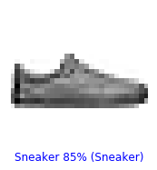
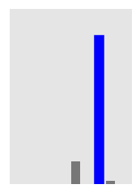
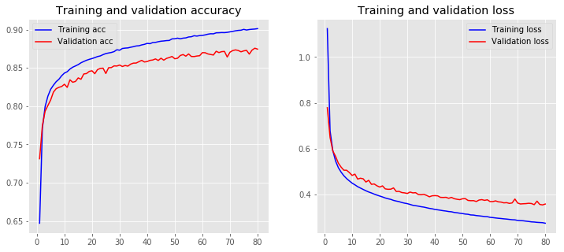
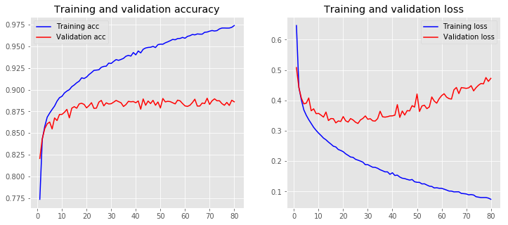
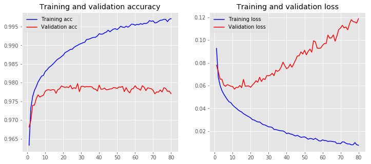

```python
from google.colab import drive
drive.mount('/content/gdrive')
```

    Go to this URL in a browser: https://accounts.google.com/o/oauth2/auth?client_id=947318989803-6bn6qk8qdgf4n4g3pfee6491hc0brc4i.apps.googleusercontent.com&redirect_uri=urn%3Aietf%3Awg%3Aoauth%3A2.0%3Aoob&scope=email%20https%3A%2F%2Fwww.googleapis.com%2Fauth%2Fdocs.test%20https%3A%2F%2Fwww.googleapis.com%2Fauth%2Fdrive%20https%3A%2F%2Fwww.googleapis.com%2Fauth%2Fdrive.photos.readonly%20https%3A%2F%2Fwww.googleapis.com%2Fauth%2Fpeopleapi.readonly&response_type=code
    
    Enter your authorization code:
    ··········
    Mounted at /content/gdrive
    


```python
# Code using keras
# TensorFlow and tf.keras
import tensorflow as tf
from tensorflow import keras
from keras import initializers

# Helper libraries
import numpy as np
import matplotlib.pyplot as plt

print(tf.__version__)
```

    1.15.0
    

    Using TensorFlow backend.
    


```python
# Load dataset
fashion_mnist = keras.datasets.fashion_mnist

(train_images, train_labels), (test_images, test_labels) = fashion_mnist.load_data()
```

    Downloading data from https://storage.googleapis.com/tensorflow/tf-keras-datasets/train-labels-idx1-ubyte.gz
    32768/29515 [=================================] - 0s 0us/step
    Downloading data from https://storage.googleapis.com/tensorflow/tf-keras-datasets/train-images-idx3-ubyte.gz
    26427392/26421880 [==============================] - 0s 0us/step
    Downloading data from https://storage.googleapis.com/tensorflow/tf-keras-datasets/t10k-labels-idx1-ubyte.gz
    8192/5148 [===============================================] - 0s 0us/step
    Downloading data from https://storage.googleapis.com/tensorflow/tf-keras-datasets/t10k-images-idx3-ubyte.gz
    4423680/4422102 [==============================] - 0s 0us/step
    


```python
class_names = ['T-shirt/top', 'Trouser', 'Pullover', 'Dress', 'Coat', 
               'Sandal', 'Shirt', 'Sneaker', 'Bag', 'Ankle boot']
```


```python
train_images.shape
```


    (60000, 28, 28)


```python
train_labels
```


    array([9, 0, 0, ..., 3, 0, 5], dtype=uint8)


```python
test_images.shape
```


    (10000, 28, 28)


```python
plt.figure()
plt.imshow(train_images[0])
plt.colorbar()
plt.grid(False)
plt.show()
```


```python
plt.figure(figsize=(10,10))
for i in range(25):
    plt.subplot(5,5,i+1)
    plt.xticks([])
    plt.yticks([])
    plt.grid(False)
    plt.imshow(train_images[i], cmap=plt.cm.binary)
    plt.xlabel(class_names[train_labels[i]])
plt.show()
```


```python
num_pixels = train_images.shape[1] * train_images.shape[2]   #28*28 = 784
X_train = train_images.reshape(train_images.shape[0], num_pixels)
X_test = test_images.reshape(test_images.shape[0], num_pixels)

# normalize inputs from 0-255 to 0-1
X_train = X_train / 255
X_test = X_test / 255


Y_test = test_labels 
from keras.utils import np_utils
# one hot encode outputs
y_train = np_utils.to_categorical(train_labels )
y_test = np_utils.to_categorical(test_labels )


from keras.models import Sequential
from keras.layers import Dense
from keras import optimizers

hidden_nodes = 128
num_classes = y_test.shape[1]

def baseline_model(crossentropy_arg, optimizer_arg):
    # create model
    model = Sequential()
    #model.add(Dense(hidden_nodes, input_dim= num_pixels, activation='relu'))
    #model.add(Dense(hidden_nodes, activation='relu'))
    #model.add(Dense(num_classes, activation='softmax'))
    model.add(Dense(hidden_nodes, input_dim= num_pixels, kernel_initializer=initializers.TruncatedNormal(mean=0.0, stddev=0.1), activation='relu'))
    model.add(Dense(hidden_nodes, kernel_initializer=initializers.TruncatedNormal(mean=0.0, stddev=0.1), activation='relu'))
    model.add(Dense(num_classes, kernel_initializer=initializers.TruncatedNormal(mean=0.0, stddev=0.1), activation='softmax'))
    #sgd = optimizers.SGD(lr=0.01, momentum=0.0, decay= 0.00)
    # Compile model
    model.compile(loss=crossentropy_arg, optimizer=optimizer_arg, metrics=['accuracy'])
    return model
```


```python
sgd = optimizers.SGD(lr=0.01, momentum=0.0, decay= 0.00)
ce = 'categorical_crossentropy'
model = baseline_model(ce, sgd)
# Fit the model
nn_simple = model.fit(X_train, y_train,validation_data=(X_test, y_test), epochs=80, batch_size=128)
# Final evaluation of the model
scores = model.evaluate(X_test, y_test)
print("Accuracy: %.2f%%" % (scores[1]*100))
```

    Train on 60000 samples, validate on 10000 samples
    Epoch 1/80
    60000/60000 [==============================] - 3s 50us/step - loss: 1.1242 - acc: 0.6472 - val_loss: 0.7786 - val_acc: 0.7314
    Epoch 2/80
    60000/60000 [==============================] - 2s 40us/step - loss: 0.6776 - acc: 0.7709 - val_loss: 0.6491 - val_acc: 0.7745
    Epoch 3/80
    60000/60000 [==============================] - 3s 43us/step - loss: 0.5910 - acc: 0.7996 - val_loss: 0.5899 - val_acc: 0.7936
    Epoch 4/80
    60000/60000 [==============================] - 2s 40us/step - loss: 0.5459 - acc: 0.8131 - val_loss: 0.5663 - val_acc: 0.8009
    Epoch 5/80
    60000/60000 [==============================] - 2s 41us/step - loss: 0.5170 - acc: 0.8221 - val_loss: 0.5366 - val_acc: 0.8081
    Epoch 6/80
    60000/60000 [==============================] - 2s 40us/step - loss: 0.4974 - acc: 0.8274 - val_loss: 0.5193 - val_acc: 0.8184
    Epoch 7/80
    60000/60000 [==============================] - 2s 40us/step - loss: 0.4817 - acc: 0.8321 - val_loss: 0.5057 - val_acc: 0.8229
    Epoch 8/80
    60000/60000 [==============================] - 2s 41us/step - loss: 0.4692 - acc: 0.8352 - val_loss: 0.5057 - val_acc: 0.8247
    Epoch 9/80
    60000/60000 [==============================] - 2s 42us/step - loss: 0.4590 - acc: 0.8399 - val_loss: 0.4954 - val_acc: 0.8258
    Epoch 10/80
    60000/60000 [==============================] - 2s 41us/step - loss: 0.4493 - acc: 0.8433 - val_loss: 0.4830 - val_acc: 0.8287
    Epoch 11/80
    60000/60000 [==============================] - 2s 41us/step - loss: 0.4420 - acc: 0.8451 - val_loss: 0.4887 - val_acc: 0.8246
    Epoch 12/80
    60000/60000 [==============================] - 2s 39us/step - loss: 0.4340 - acc: 0.8485 - val_loss: 0.4671 - val_acc: 0.8345
    Epoch 13/80
    60000/60000 [==============================] - 2s 40us/step - loss: 0.4279 - acc: 0.8510 - val_loss: 0.4708 - val_acc: 0.8313
    Epoch 14/80
    60000/60000 [==============================] - 2s 39us/step - loss: 0.4218 - acc: 0.8526 - val_loss: 0.4683 - val_acc: 0.8324
    Epoch 15/80
    60000/60000 [==============================] - 2s 40us/step - loss: 0.4160 - acc: 0.8544 - val_loss: 0.4541 - val_acc: 0.8370
    Epoch 16/80
    60000/60000 [==============================] - 2s 41us/step - loss: 0.4107 - acc: 0.8567 - val_loss: 0.4617 - val_acc: 0.8352
    Epoch 17/80
    60000/60000 [==============================] - 2s 40us/step - loss: 0.4064 - acc: 0.8584 - val_loss: 0.4442 - val_acc: 0.8421
    Epoch 18/80
    60000/60000 [==============================] - 2s 40us/step - loss: 0.4014 - acc: 0.8600 - val_loss: 0.4457 - val_acc: 0.8427
    Epoch 19/80
    60000/60000 [==============================] - 2s 41us/step - loss: 0.3970 - acc: 0.8612 - val_loss: 0.4377 - val_acc: 0.8455
    Epoch 20/80
    60000/60000 [==============================] - 2s 40us/step - loss: 0.3930 - acc: 0.8623 - val_loss: 0.4322 - val_acc: 0.8463
    Epoch 21/80
    60000/60000 [==============================] - 2s 40us/step - loss: 0.3891 - acc: 0.8635 - val_loss: 0.4373 - val_acc: 0.8425
    Epoch 22/80
    60000/60000 [==============================] - 2s 41us/step - loss: 0.3845 - acc: 0.8649 - val_loss: 0.4243 - val_acc: 0.8479
    Epoch 23/80
    60000/60000 [==============================] - 2s 41us/step - loss: 0.3812 - acc: 0.8657 - val_loss: 0.4224 - val_acc: 0.8494
    Epoch 24/80
    60000/60000 [==============================] - 2s 39us/step - loss: 0.3784 - acc: 0.8674 - val_loss: 0.4229 - val_acc: 0.8497
    Epoch 25/80
    60000/60000 [==============================] - 2s 40us/step - loss: 0.3740 - acc: 0.8688 - val_loss: 0.4285 - val_acc: 0.8428
    Epoch 26/80
    60000/60000 [==============================] - 2s 41us/step - loss: 0.3711 - acc: 0.8696 - val_loss: 0.4128 - val_acc: 0.8503
    Epoch 27/80
    60000/60000 [==============================] - 2s 41us/step - loss: 0.3686 - acc: 0.8702 - val_loss: 0.4134 - val_acc: 0.8505
    Epoch 28/80
    60000/60000 [==============================] - 2s 39us/step - loss: 0.3647 - acc: 0.8713 - val_loss: 0.4082 - val_acc: 0.8527
    Epoch 29/80
    60000/60000 [==============================] - 2s 40us/step - loss: 0.3619 - acc: 0.8738 - val_loss: 0.4068 - val_acc: 0.8525
    Epoch 30/80
    60000/60000 [==============================] - 3s 43us/step - loss: 0.3598 - acc: 0.8732 - val_loss: 0.4042 - val_acc: 0.8538
    Epoch 31/80
    60000/60000 [==============================] - 2s 40us/step - loss: 0.3562 - acc: 0.8754 - val_loss: 0.4104 - val_acc: 0.8519
    Epoch 32/80
    60000/60000 [==============================] - 2s 41us/step - loss: 0.3526 - acc: 0.8759 - val_loss: 0.4068 - val_acc: 0.8532
    Epoch 33/80
    60000/60000 [==============================] - 2s 40us/step - loss: 0.3508 - acc: 0.8762 - val_loss: 0.4077 - val_acc: 0.8524
    Epoch 34/80
    60000/60000 [==============================] - 2s 41us/step - loss: 0.3488 - acc: 0.8771 - val_loss: 0.3996 - val_acc: 0.8550
    Epoch 35/80
    60000/60000 [==============================] - 2s 40us/step - loss: 0.3463 - acc: 0.8778 - val_loss: 0.3986 - val_acc: 0.8563
    Epoch 36/80
    60000/60000 [==============================] - 2s 40us/step - loss: 0.3446 - acc: 0.8787 - val_loss: 0.4004 - val_acc: 0.8564
    Epoch 37/80
    60000/60000 [==============================] - 3s 42us/step - loss: 0.3419 - acc: 0.8790 - val_loss: 0.3957 - val_acc: 0.8582
    Epoch 38/80
    60000/60000 [==============================] - 2s 41us/step - loss: 0.3391 - acc: 0.8801 - val_loss: 0.3897 - val_acc: 0.8599
    Epoch 39/80
    60000/60000 [==============================] - 3s 43us/step - loss: 0.3373 - acc: 0.8808 - val_loss: 0.3941 - val_acc: 0.8578
    Epoch 40/80
    60000/60000 [==============================] - 3s 42us/step - loss: 0.3345 - acc: 0.8821 - val_loss: 0.3948 - val_acc: 0.8584
    Epoch 41/80
    60000/60000 [==============================] - 2s 41us/step - loss: 0.3328 - acc: 0.8817 - val_loss: 0.3939 - val_acc: 0.8599
    Epoch 42/80
    60000/60000 [==============================] - 3s 42us/step - loss: 0.3309 - acc: 0.8831 - val_loss: 0.3872 - val_acc: 0.8604
    Epoch 43/80
    60000/60000 [==============================] - 3s 42us/step - loss: 0.3289 - acc: 0.8834 - val_loss: 0.3867 - val_acc: 0.8618
    Epoch 44/80
    60000/60000 [==============================] - 2s 41us/step - loss: 0.3274 - acc: 0.8843 - val_loss: 0.3874 - val_acc: 0.8598
    Epoch 45/80
    60000/60000 [==============================] - 2s 41us/step - loss: 0.3253 - acc: 0.8849 - val_loss: 0.3831 - val_acc: 0.8627
    Epoch 46/80
    60000/60000 [==============================] - 2s 41us/step - loss: 0.3242 - acc: 0.8853 - val_loss: 0.3870 - val_acc: 0.8602
    Epoch 47/80
    60000/60000 [==============================] - 2s 41us/step - loss: 0.3214 - acc: 0.8857 - val_loss: 0.3814 - val_acc: 0.8625
    Epoch 48/80
    60000/60000 [==============================] - 2s 40us/step - loss: 0.3200 - acc: 0.8859 - val_loss: 0.3789 - val_acc: 0.8636
    Epoch 49/80
    60000/60000 [==============================] - 2s 40us/step - loss: 0.3181 - acc: 0.8880 - val_loss: 0.3772 - val_acc: 0.8650
    Epoch 50/80
    60000/60000 [==============================] - 3s 42us/step - loss: 0.3164 - acc: 0.8881 - val_loss: 0.3810 - val_acc: 0.8620
    Epoch 51/80
    60000/60000 [==============================] - 3s 44us/step - loss: 0.3143 - acc: 0.8889 - val_loss: 0.3816 - val_acc: 0.8627
    Epoch 52/80
    60000/60000 [==============================] - 3s 43us/step - loss: 0.3133 - acc: 0.8881 - val_loss: 0.3739 - val_acc: 0.8663
    Epoch 53/80
    60000/60000 [==============================] - 2s 41us/step - loss: 0.3104 - acc: 0.8890 - val_loss: 0.3727 - val_acc: 0.8675
    Epoch 54/80
    60000/60000 [==============================] - 2s 41us/step - loss: 0.3099 - acc: 0.8893 - val_loss: 0.3729 - val_acc: 0.8654
    Epoch 55/80
    60000/60000 [==============================] - 2s 41us/step - loss: 0.3077 - acc: 0.8905 - val_loss: 0.3691 - val_acc: 0.8683
    Epoch 56/80
    60000/60000 [==============================] - 2s 41us/step - loss: 0.3065 - acc: 0.8908 - val_loss: 0.3755 - val_acc: 0.8650
    Epoch 57/80
    60000/60000 [==============================] - 3s 42us/step - loss: 0.3051 - acc: 0.8921 - val_loss: 0.3773 - val_acc: 0.8649
    Epoch 58/80
    60000/60000 [==============================] - 2s 40us/step - loss: 0.3034 - acc: 0.8916 - val_loss: 0.3741 - val_acc: 0.8656
    Epoch 59/80
    60000/60000 [==============================] - 2s 40us/step - loss: 0.3029 - acc: 0.8923 - val_loss: 0.3765 - val_acc: 0.8660
    Epoch 60/80
    60000/60000 [==============================] - 3s 42us/step - loss: 0.2999 - acc: 0.8925 - val_loss: 0.3687 - val_acc: 0.8700
    Epoch 61/80
    60000/60000 [==============================] - 2s 39us/step - loss: 0.2988 - acc: 0.8932 - val_loss: 0.3688 - val_acc: 0.8699
    Epoch 62/80
    60000/60000 [==============================] - 2s 40us/step - loss: 0.2972 - acc: 0.8941 - val_loss: 0.3719 - val_acc: 0.8683
    Epoch 63/80
    60000/60000 [==============================] - 2s 41us/step - loss: 0.2959 - acc: 0.8947 - val_loss: 0.3676 - val_acc: 0.8676
    Epoch 64/80
    60000/60000 [==============================] - 3s 42us/step - loss: 0.2948 - acc: 0.8946 - val_loss: 0.3666 - val_acc: 0.8669
    Epoch 65/80
    60000/60000 [==============================] - 2s 40us/step - loss: 0.2934 - acc: 0.8959 - val_loss: 0.3631 - val_acc: 0.8718
    Epoch 66/80
    60000/60000 [==============================] - 2s 39us/step - loss: 0.2924 - acc: 0.8960 - val_loss: 0.3641 - val_acc: 0.8701
    Epoch 67/80
    60000/60000 [==============================] - 3s 42us/step - loss: 0.2909 - acc: 0.8962 - val_loss: 0.3608 - val_acc: 0.8713
    Epoch 68/80
    60000/60000 [==============================] - 2s 42us/step - loss: 0.2895 - acc: 0.8961 - val_loss: 0.3629 - val_acc: 0.8716
    Epoch 69/80
    60000/60000 [==============================] - 2s 39us/step - loss: 0.2889 - acc: 0.8965 - val_loss: 0.3800 - val_acc: 0.8643
    Epoch 70/80
    60000/60000 [==============================] - 2s 40us/step - loss: 0.2864 - acc: 0.8972 - val_loss: 0.3624 - val_acc: 0.8706
    Epoch 71/80
    60000/60000 [==============================] - 3s 42us/step - loss: 0.2856 - acc: 0.8978 - val_loss: 0.3583 - val_acc: 0.8727
    Epoch 72/80
    60000/60000 [==============================] - 2s 40us/step - loss: 0.2849 - acc: 0.8985 - val_loss: 0.3593 - val_acc: 0.8736
    Epoch 73/80
    60000/60000 [==============================] - 2s 40us/step - loss: 0.2833 - acc: 0.8991 - val_loss: 0.3599 - val_acc: 0.8728
    Epoch 74/80
    60000/60000 [==============================] - 2s 40us/step - loss: 0.2819 - acc: 0.8993 - val_loss: 0.3614 - val_acc: 0.8711
    Epoch 75/80
    60000/60000 [==============================] - 2s 41us/step - loss: 0.2801 - acc: 0.9004 - val_loss: 0.3603 - val_acc: 0.8723
    Epoch 76/80
    60000/60000 [==============================] - 2s 42us/step - loss: 0.2794 - acc: 0.8995 - val_loss: 0.3554 - val_acc: 0.8730
    Epoch 77/80
    60000/60000 [==============================] - 3s 42us/step - loss: 0.2781 - acc: 0.9002 - val_loss: 0.3707 - val_acc: 0.8681
    Epoch 78/80
    60000/60000 [==============================] - 2s 41us/step - loss: 0.2773 - acc: 0.9006 - val_loss: 0.3564 - val_acc: 0.8733
    Epoch 79/80
    60000/60000 [==============================] - 2s 40us/step - loss: 0.2767 - acc: 0.9008 - val_loss: 0.3542 - val_acc: 0.8758
    Epoch 80/80
    60000/60000 [==============================] - 2s 41us/step - loss: 0.2743 - acc: 0.9014 - val_loss: 0.3581 - val_acc: 0.8746
    10000/10000 [==============================] - 1s 59us/step
    Accuracy: 87.46%
    


```python
predictions = model.predict(X_test)
predictions[0]
```


    array([1.0838462e-05, 1.8145710e-07, 2.5723355e-06, 2.2188851e-05,
           1.3505474e-06, 1.9608868e-02, 2.0966630e-05, 1.1648308e-02,
           9.2673179e-04, 9.6775806e-01], dtype=float32)


```python
def plot_image(i, predictions_array, true_label, img):
  predictions_array, true_label, img = predictions_array[i], true_label[i], img[i]
  plt.grid(False)
  plt.xticks([])
  plt.yticks([])
  
  plt.imshow(img, cmap=plt.cm.binary)

  predicted_label = np.argmax(predictions_array)
  if predicted_label == true_label:
    color = 'blue'
  else:
    color = 'red'
  
  plt.xlabel("{} {:2.0f}% ({})".format(class_names[predicted_label],
                                100*np.max(predictions_array),
                                class_names[true_label]),
                                color=color)

def plot_value_array(i, predictions_array, true_label):
  predictions_array, true_label = predictions_array[i], true_label[i]
  plt.grid(False)
  plt.xticks([])
  plt.yticks([])
  thisplot = plt.bar(range(10), predictions_array, color="#777777")
  plt.ylim([0, 1]) 
  predicted_label = np.argmax(predictions_array)
 
  thisplot[predicted_label].set_color('red')
  thisplot[true_label].set_color('blue')
```


```python
i = 12
plt.figure(figsize=(6,3))
plt.subplot(1,2,1)
plot_image(i, predictions, Y_test, test_images)
plt.show()
plt.subplot(1,2,2)
plot_value_array(i, predictions,  Y_test)
plt.show()
```








**Learning curves has an important role in developing any machine learning algorithm. To understand the effect of changing the hyper parameters and their effect on deep network that we designed, draw two learning curves for Accuracy of test vs. epochs (start from 5 epochs and go up to 75 with the step of 5).** 

Repeat this analysis two times: 1) With Adam algorithm 2) With SGD


```python
import matplotlib.pyplot as plt
plt.style.use('ggplot')
def plot_history(history):
  acc = history.history['acc']

  val_acc = history.history['val_acc']
  loss = history.history['loss']
  val_loss = history.history['val_loss']
  x = range(1, len(acc) + 1)

  plt.figure(figsize=(12, 5))
  plt.subplot(1, 2, 1)
  plt.plot(x, acc, 'b', label='Training acc')
  plt.plot(x, val_acc, 'r', label='Validation acc')
  plt.title('Training and validation accuracy')
  plt.legend()
  plt.subplot(1, 2, 2)
  plt.plot(x, loss, 'b', label='Training loss')
  plt.plot(x, val_loss, 'r', label='Validation loss')
  plt.title('Training and validation loss')
  plt.legend()
  plt.show()
```


```python
plot_history(nn_simple)
```





### SGD MODEL


```python
sgd_2 = optimizers.SGD(lr=0.01, momentum=0.9, decay= 0.00)
ce = 'categorical_crossentropy'
model_sgd = baseline_model(ce, sgd_2)
# Fit the model
nn_sgd = model_sgd.fit(X_train, y_train,validation_data=(X_test, y_test), epochs=80, batch_size=128)
# Final evaluation of the model
scores_sgd = model_sgd.evaluate(X_test, y_test)
print("Accuracy: %.2f%%" % (scores_sgd[1]*100))
```

    Train on 60000 samples, validate on 10000 samples
    Epoch 1/80
    60000/60000 [==============================] - 3s 53us/step - loss: 0.6464 - acc: 0.7736 - val_loss: 0.5079 - val_acc: 0.8207
    Epoch 2/80
    60000/60000 [==============================] - 2s 41us/step - loss: 0.4430 - acc: 0.8427 - val_loss: 0.4418 - val_acc: 0.8434
    Epoch 3/80
    60000/60000 [==============================] - 2s 41us/step - loss: 0.4013 - acc: 0.8575 - val_loss: 0.4074 - val_acc: 0.8550
    Epoch 4/80
    60000/60000 [==============================] - 3s 42us/step - loss: 0.3690 - acc: 0.8682 - val_loss: 0.3886 - val_acc: 0.8606
    Epoch 5/80
    60000/60000 [==============================] - 2s 41us/step - loss: 0.3510 - acc: 0.8730 - val_loss: 0.3909 - val_acc: 0.8627
    Epoch 6/80
    60000/60000 [==============================] - 2s 42us/step - loss: 0.3366 - acc: 0.8772 - val_loss: 0.4079 - val_acc: 0.8547
    Epoch 7/80
    60000/60000 [==============================] - 2s 41us/step - loss: 0.3239 - acc: 0.8811 - val_loss: 0.3659 - val_acc: 0.8674
    Epoch 8/80
    60000/60000 [==============================] - 3s 45us/step - loss: 0.3112 - acc: 0.8868 - val_loss: 0.3722 - val_acc: 0.8644
    Epoch 9/80
    60000/60000 [==============================] - 2s 41us/step - loss: 0.3012 - acc: 0.8908 - val_loss: 0.3563 - val_acc: 0.8714
    Epoch 10/80
    60000/60000 [==============================] - 2s 41us/step - loss: 0.2922 - acc: 0.8923 - val_loss: 0.3572 - val_acc: 0.8715
    Epoch 11/80
    60000/60000 [==============================] - 2s 41us/step - loss: 0.2844 - acc: 0.8962 - val_loss: 0.3513 - val_acc: 0.8739
    Epoch 12/80
    60000/60000 [==============================] - 2s 41us/step - loss: 0.2759 - acc: 0.8984 - val_loss: 0.3451 - val_acc: 0.8773
    Epoch 13/80
    60000/60000 [==============================] - 2s 41us/step - loss: 0.2703 - acc: 0.9000 - val_loss: 0.3617 - val_acc: 0.8675
    Epoch 14/80
    60000/60000 [==============================] - 3s 42us/step - loss: 0.2628 - acc: 0.9034 - val_loss: 0.3337 - val_acc: 0.8787
    Epoch 15/80
    60000/60000 [==============================] - 3s 43us/step - loss: 0.2563 - acc: 0.9054 - val_loss: 0.3402 - val_acc: 0.8804
    Epoch 16/80
    60000/60000 [==============================] - 2s 41us/step - loss: 0.2491 - acc: 0.9079 - val_loss: 0.3398 - val_acc: 0.8786
    Epoch 17/80
    60000/60000 [==============================] - 2s 40us/step - loss: 0.2467 - acc: 0.9098 - val_loss: 0.3259 - val_acc: 0.8836
    Epoch 18/80
    60000/60000 [==============================] - 2s 40us/step - loss: 0.2384 - acc: 0.9137 - val_loss: 0.3323 - val_acc: 0.8843
    Epoch 19/80
    60000/60000 [==============================] - 2s 41us/step - loss: 0.2352 - acc: 0.9129 - val_loss: 0.3306 - val_acc: 0.8830
    Epoch 20/80
    60000/60000 [==============================] - 2s 41us/step - loss: 0.2311 - acc: 0.9145 - val_loss: 0.3467 - val_acc: 0.8790
    Epoch 21/80
    60000/60000 [==============================] - 3s 42us/step - loss: 0.2242 - acc: 0.9174 - val_loss: 0.3329 - val_acc: 0.8816
    Epoch 22/80
    60000/60000 [==============================] - 2s 40us/step - loss: 0.2190 - acc: 0.9196 - val_loss: 0.3285 - val_acc: 0.8850
    Epoch 23/80
    60000/60000 [==============================] - 3s 42us/step - loss: 0.2136 - acc: 0.9222 - val_loss: 0.3402 - val_acc: 0.8784
    Epoch 24/80
    60000/60000 [==============================] - 2s 39us/step - loss: 0.2124 - acc: 0.9225 - val_loss: 0.3357 - val_acc: 0.8787
    Epoch 25/80
    60000/60000 [==============================] - 2s 39us/step - loss: 0.2061 - acc: 0.9229 - val_loss: 0.3282 - val_acc: 0.8856
    Epoch 26/80
    60000/60000 [==============================] - 2s 38us/step - loss: 0.2032 - acc: 0.9258 - val_loss: 0.3241 - val_acc: 0.8876
    Epoch 27/80
    60000/60000 [==============================] - 2s 40us/step - loss: 0.2002 - acc: 0.9268 - val_loss: 0.3355 - val_acc: 0.8813
    Epoch 28/80
    60000/60000 [==============================] - 3s 42us/step - loss: 0.1967 - acc: 0.9271 - val_loss: 0.3406 - val_acc: 0.8848
    Epoch 29/80
    60000/60000 [==============================] - 2s 40us/step - loss: 0.1883 - acc: 0.9306 - val_loss: 0.3488 - val_acc: 0.8835
    Epoch 30/80
    60000/60000 [==============================] - 2s 40us/step - loss: 0.1884 - acc: 0.9302 - val_loss: 0.3379 - val_acc: 0.8838
    Epoch 31/80
    60000/60000 [==============================] - 2s 40us/step - loss: 0.1840 - acc: 0.9325 - val_loss: 0.3397 - val_acc: 0.8856
    Epoch 32/80
    60000/60000 [==============================] - 2s 39us/step - loss: 0.1799 - acc: 0.9347 - val_loss: 0.3327 - val_acc: 0.8876
    Epoch 33/80
    60000/60000 [==============================] - 2s 39us/step - loss: 0.1795 - acc: 0.9338 - val_loss: 0.3319 - val_acc: 0.8862
    Epoch 34/80
    60000/60000 [==============================] - 2s 40us/step - loss: 0.1765 - acc: 0.9348 - val_loss: 0.3401 - val_acc: 0.8849
    Epoch 35/80
    60000/60000 [==============================] - 2s 41us/step - loss: 0.1717 - acc: 0.9360 - val_loss: 0.3643 - val_acc: 0.8806
    Epoch 36/80
    60000/60000 [==============================] - 2s 40us/step - loss: 0.1684 - acc: 0.9385 - val_loss: 0.3460 - val_acc: 0.8828
    Epoch 37/80
    60000/60000 [==============================] - 2s 40us/step - loss: 0.1647 - acc: 0.9395 - val_loss: 0.3449 - val_acc: 0.8865
    Epoch 38/80
    60000/60000 [==============================] - 2s 40us/step - loss: 0.1648 - acc: 0.9387 - val_loss: 0.3463 - val_acc: 0.8860
    Epoch 39/80
    60000/60000 [==============================] - 2s 40us/step - loss: 0.1566 - acc: 0.9428 - val_loss: 0.3488 - val_acc: 0.8863
    Epoch 40/80
    60000/60000 [==============================] - 2s 40us/step - loss: 0.1617 - acc: 0.9401 - val_loss: 0.3491 - val_acc: 0.8849
    Epoch 41/80
    60000/60000 [==============================] - 2s 39us/step - loss: 0.1528 - acc: 0.9446 - val_loss: 0.3513 - val_acc: 0.8870
    Epoch 42/80
    60000/60000 [==============================] - 2s 40us/step - loss: 0.1540 - acc: 0.9424 - val_loss: 0.3861 - val_acc: 0.8775
    Epoch 43/80
    60000/60000 [==============================] - 2s 41us/step - loss: 0.1476 - acc: 0.9465 - val_loss: 0.3440 - val_acc: 0.8893
    Epoch 44/80
    60000/60000 [==============================] - 2s 41us/step - loss: 0.1438 - acc: 0.9480 - val_loss: 0.3650 - val_acc: 0.8820
    Epoch 45/80
    60000/60000 [==============================] - 2s 40us/step - loss: 0.1426 - acc: 0.9487 - val_loss: 0.3518 - val_acc: 0.8869
    Epoch 46/80
    60000/60000 [==============================] - 2s 41us/step - loss: 0.1398 - acc: 0.9489 - val_loss: 0.3664 - val_acc: 0.8840
    Epoch 47/80
    60000/60000 [==============================] - 2s 39us/step - loss: 0.1377 - acc: 0.9499 - val_loss: 0.3655 - val_acc: 0.8877
    Epoch 48/80
    60000/60000 [==============================] - 2s 41us/step - loss: 0.1395 - acc: 0.9486 - val_loss: 0.3826 - val_acc: 0.8820
    Epoch 49/80
    60000/60000 [==============================] - 3s 43us/step - loss: 0.1322 - acc: 0.9519 - val_loss: 0.3780 - val_acc: 0.8858
    Epoch 50/80
    60000/60000 [==============================] - 2s 41us/step - loss: 0.1304 - acc: 0.9525 - val_loss: 0.4211 - val_acc: 0.8789
    Epoch 51/80
    60000/60000 [==============================] - 2s 41us/step - loss: 0.1301 - acc: 0.9524 - val_loss: 0.3635 - val_acc: 0.8898
    Epoch 52/80
    60000/60000 [==============================] - 2s 40us/step - loss: 0.1250 - acc: 0.9540 - val_loss: 0.3816 - val_acc: 0.8859
    Epoch 53/80
    60000/60000 [==============================] - 2s 38us/step - loss: 0.1254 - acc: 0.9551 - val_loss: 0.3841 - val_acc: 0.8866
    Epoch 54/80
    60000/60000 [==============================] - 2s 40us/step - loss: 0.1214 - acc: 0.9564 - val_loss: 0.3728 - val_acc: 0.8862
    Epoch 55/80
    60000/60000 [==============================] - 2s 40us/step - loss: 0.1177 - acc: 0.9579 - val_loss: 0.3784 - val_acc: 0.8849
    Epoch 56/80
    60000/60000 [==============================] - 2s 41us/step - loss: 0.1167 - acc: 0.9575 - val_loss: 0.4113 - val_acc: 0.8836
    Epoch 57/80
    60000/60000 [==============================] - 2s 40us/step - loss: 0.1117 - acc: 0.9589 - val_loss: 0.3978 - val_acc: 0.8879
    Epoch 58/80
    60000/60000 [==============================] - 3s 42us/step - loss: 0.1124 - acc: 0.9591 - val_loss: 0.3908 - val_acc: 0.8871
    Epoch 59/80
    60000/60000 [==============================] - 2s 39us/step - loss: 0.1107 - acc: 0.9602 - val_loss: 0.4056 - val_acc: 0.8840
    Epoch 60/80
    60000/60000 [==============================] - 2s 40us/step - loss: 0.1105 - acc: 0.9593 - val_loss: 0.4156 - val_acc: 0.8813
    Epoch 61/80
    60000/60000 [==============================] - 2s 40us/step - loss: 0.1078 - acc: 0.9614 - val_loss: 0.4220 - val_acc: 0.8807
    Epoch 62/80
    60000/60000 [==============================] - 2s 41us/step - loss: 0.1048 - acc: 0.9622 - val_loss: 0.4108 - val_acc: 0.8820
    Epoch 63/80
    60000/60000 [==============================] - 3s 42us/step - loss: 0.1015 - acc: 0.9636 - val_loss: 0.4059 - val_acc: 0.8851
    Epoch 64/80
    60000/60000 [==============================] - 2s 39us/step - loss: 0.1013 - acc: 0.9632 - val_loss: 0.4044 - val_acc: 0.8890
    Epoch 65/80
    60000/60000 [==============================] - 2s 39us/step - loss: 0.0988 - acc: 0.9642 - val_loss: 0.4347 - val_acc: 0.8811
    Epoch 66/80
    60000/60000 [==============================] - 2s 39us/step - loss: 0.0990 - acc: 0.9640 - val_loss: 0.4425 - val_acc: 0.8811
    Epoch 67/80
    60000/60000 [==============================] - 2s 39us/step - loss: 0.0990 - acc: 0.9640 - val_loss: 0.4224 - val_acc: 0.8846
    Epoch 68/80
    60000/60000 [==============================] - 2s 40us/step - loss: 0.0937 - acc: 0.9662 - val_loss: 0.4421 - val_acc: 0.8840
    Epoch 69/80
    60000/60000 [==============================] - 3s 42us/step - loss: 0.0930 - acc: 0.9664 - val_loss: 0.4411 - val_acc: 0.8901
    Epoch 70/80
    60000/60000 [==============================] - 2s 41us/step - loss: 0.0920 - acc: 0.9674 - val_loss: 0.4395 - val_acc: 0.8830
    Epoch 71/80
    60000/60000 [==============================] - 2s 39us/step - loss: 0.0891 - acc: 0.9682 - val_loss: 0.4414 - val_acc: 0.8872
    Epoch 72/80
    60000/60000 [==============================] - 2s 40us/step - loss: 0.0900 - acc: 0.9676 - val_loss: 0.4483 - val_acc: 0.8894
    Epoch 73/80
    60000/60000 [==============================] - 2s 40us/step - loss: 0.0885 - acc: 0.9681 - val_loss: 0.4313 - val_acc: 0.8872
    Epoch 74/80
    60000/60000 [==============================] - 2s 39us/step - loss: 0.0829 - acc: 0.9700 - val_loss: 0.4420 - val_acc: 0.8872
    Epoch 75/80
    60000/60000 [==============================] - 2s 40us/step - loss: 0.0814 - acc: 0.9710 - val_loss: 0.4501 - val_acc: 0.8839
    Epoch 76/80
    60000/60000 [==============================] - 2s 41us/step - loss: 0.0802 - acc: 0.9711 - val_loss: 0.4557 - val_acc: 0.8820
    Epoch 77/80
    60000/60000 [==============================] - 2s 41us/step - loss: 0.0802 - acc: 0.9710 - val_loss: 0.4545 - val_acc: 0.8853
    Epoch 78/80
    60000/60000 [==============================] - 2s 41us/step - loss: 0.0802 - acc: 0.9710 - val_loss: 0.4752 - val_acc: 0.8818
    Epoch 79/80
    60000/60000 [==============================] - 2s 40us/step - loss: 0.0783 - acc: 0.9718 - val_loss: 0.4625 - val_acc: 0.8878
    Epoch 80/80
    60000/60000 [==============================] - 2s 40us/step - loss: 0.0744 - acc: 0.9739 - val_loss: 0.4727 - val_acc: 0.8860
    10000/10000 [==============================] - 1s 60us/step
    Accuracy: 88.60%
    


```python
predictions_sgd = model_sgd.predict(X_test)
predictions_sgd[0]
```


    array([1.0415937e-15, 1.4006737e-12, 7.2244625e-17, 7.1258571e-14,
           4.8755454e-15, 3.5855124e-10, 1.6993426e-17, 3.2132411e-07,
           1.1062492e-14, 9.9999964e-01], dtype=float32)


```python
plot_history(nn_sgd)
```





```python
i = 12
plt.figure(figsize=(6,3))
plt.subplot(1,2,1)
plot_image(i, predictions_sgd, Y_test, test_images)
plt.show()
plt.subplot(1,2,2)
plot_value_array(i, predictions_sgd,  Y_test)
plt.show()
```


### ADAM MODEL


```python
adam_opt = optimizers.Adam(lr=0.001, beta_1=0.9, beta_2=0.999, amsgrad=False)
ce = 'binary_crossentropy'

model_adam = baseline_model(ce, adam_opt)

# Fit the model
nn_adam = model_adam.fit(X_train, y_train,validation_data=(X_test, y_test), epochs=80, batch_size=128)
# Final evaluation of the model
scores_adam = model_adam.evaluate(X_test, y_test)
print("Accuracy: %.2f%%" % (scores_adam[1]*100))
```

    Train on 60000 samples, validate on 10000 samples
    Epoch 1/80
    60000/60000 [==============================] - 4s 62us/step - loss: 0.0927 - acc: 0.9632 - val_loss: 0.0779 - val_acc: 0.9681
    Epoch 2/80
    60000/60000 [==============================] - 3s 49us/step - loss: 0.0674 - acc: 0.9733 - val_loss: 0.0724 - val_acc: 0.9699
    Epoch 3/80
    60000/60000 [==============================] - 3s 49us/step - loss: 0.0602 - acc: 0.9763 - val_loss: 0.0657 - val_acc: 0.9739
    Epoch 4/80
    60000/60000 [==============================] - 3s 46us/step - loss: 0.0557 - acc: 0.9779 - val_loss: 0.0656 - val_acc: 0.9740
    Epoch 5/80
    60000/60000 [==============================] - 3s 49us/step - loss: 0.0526 - acc: 0.9789 - val_loss: 0.0605 - val_acc: 0.9757
    Epoch 6/80
    60000/60000 [==============================] - 3s 48us/step - loss: 0.0502 - acc: 0.9802 - val_loss: 0.0594 - val_acc: 0.9767
    Epoch 7/80
    60000/60000 [==============================] - 3s 47us/step - loss: 0.0477 - acc: 0.9810 - val_loss: 0.0608 - val_acc: 0.9761
    Epoch 8/80
    60000/60000 [==============================] - 3s 50us/step - loss: 0.0458 - acc: 0.9817 - val_loss: 0.0602 - val_acc: 0.9764
    Epoch 9/80
    60000/60000 [==============================] - 3s 47us/step - loss: 0.0450 - acc: 0.9820 - val_loss: 0.0594 - val_acc: 0.9766
    Epoch 10/80
    60000/60000 [==============================] - 3s 48us/step - loss: 0.0429 - acc: 0.9830 - val_loss: 0.0592 - val_acc: 0.9777
    Epoch 11/80
    60000/60000 [==============================] - 3s 48us/step - loss: 0.0414 - acc: 0.9834 - val_loss: 0.0569 - val_acc: 0.9780
    Epoch 12/80
    60000/60000 [==============================] - 3s 47us/step - loss: 0.0402 - acc: 0.9840 - val_loss: 0.0585 - val_acc: 0.9781
    Epoch 13/80
    60000/60000 [==============================] - 3s 47us/step - loss: 0.0387 - acc: 0.9844 - val_loss: 0.0584 - val_acc: 0.9780
    Epoch 14/80
    60000/60000 [==============================] - 3s 51us/step - loss: 0.0376 - acc: 0.9848 - val_loss: 0.0601 - val_acc: 0.9781
    Epoch 15/80
    60000/60000 [==============================] - 3s 47us/step - loss: 0.0368 - acc: 0.9853 - val_loss: 0.0582 - val_acc: 0.9781
    Epoch 16/80
    60000/60000 [==============================] - 3s 48us/step - loss: 0.0354 - acc: 0.9859 - val_loss: 0.0654 - val_acc: 0.9771
    Epoch 17/80
    60000/60000 [==============================] - 3s 47us/step - loss: 0.0345 - acc: 0.9863 - val_loss: 0.0594 - val_acc: 0.9781
    Epoch 18/80
    60000/60000 [==============================] - 3s 49us/step - loss: 0.0335 - acc: 0.9866 - val_loss: 0.0596 - val_acc: 0.9784
    Epoch 19/80
    60000/60000 [==============================] - 3s 50us/step - loss: 0.0326 - acc: 0.9870 - val_loss: 0.0596 - val_acc: 0.9791
    Epoch 20/80
    60000/60000 [==============================] - 3s 53us/step - loss: 0.0317 - acc: 0.9873 - val_loss: 0.0586 - val_acc: 0.9789
    Epoch 21/80
    60000/60000 [==============================] - 3s 49us/step - loss: 0.0301 - acc: 0.9880 - val_loss: 0.0604 - val_acc: 0.9787
    Epoch 22/80
    60000/60000 [==============================] - 3s 48us/step - loss: 0.0298 - acc: 0.9883 - val_loss: 0.0622 - val_acc: 0.9789
    Epoch 23/80
    60000/60000 [==============================] - 3s 47us/step - loss: 0.0288 - acc: 0.9886 - val_loss: 0.0643 - val_acc: 0.9787
    Epoch 24/80
    60000/60000 [==============================] - 3s 48us/step - loss: 0.0281 - acc: 0.9889 - val_loss: 0.0630 - val_acc: 0.9793
    Epoch 25/80
    60000/60000 [==============================] - 3s 52us/step - loss: 0.0281 - acc: 0.9889 - val_loss: 0.0673 - val_acc: 0.9783
    Epoch 26/80
    60000/60000 [==============================] - 3s 48us/step - loss: 0.0268 - acc: 0.9894 - val_loss: 0.0636 - val_acc: 0.9786
    Epoch 27/80
    60000/60000 [==============================] - 3s 49us/step - loss: 0.0257 - acc: 0.9898 - val_loss: 0.0661 - val_acc: 0.9784
    Epoch 28/80
    60000/60000 [==============================] - 3s 48us/step - loss: 0.0254 - acc: 0.9900 - val_loss: 0.0653 - val_acc: 0.9797
    Epoch 29/80
    60000/60000 [==============================] - 3s 48us/step - loss: 0.0246 - acc: 0.9903 - val_loss: 0.0688 - val_acc: 0.9776
    Epoch 30/80
    60000/60000 [==============================] - 3s 48us/step - loss: 0.0238 - acc: 0.9905 - val_loss: 0.0686 - val_acc: 0.9790
    Epoch 31/80
    60000/60000 [==============================] - 3s 49us/step - loss: 0.0237 - acc: 0.9907 - val_loss: 0.0692 - val_acc: 0.9790
    Epoch 32/80
    60000/60000 [==============================] - 3s 48us/step - loss: 0.0232 - acc: 0.9908 - val_loss: 0.0708 - val_acc: 0.9788
    Epoch 33/80
    60000/60000 [==============================] - 3s 48us/step - loss: 0.0215 - acc: 0.9915 - val_loss: 0.0687 - val_acc: 0.9790
    Epoch 34/80
    60000/60000 [==============================] - 3s 47us/step - loss: 0.0214 - acc: 0.9916 - val_loss: 0.0735 - val_acc: 0.9789
    Epoch 35/80
    60000/60000 [==============================] - 3s 47us/step - loss: 0.0210 - acc: 0.9918 - val_loss: 0.0725 - val_acc: 0.9790
    Epoch 36/80
    60000/60000 [==============================] - 3s 48us/step - loss: 0.0206 - acc: 0.9920 - val_loss: 0.0736 - val_acc: 0.9788
    Epoch 37/80
    60000/60000 [==============================] - 3s 50us/step - loss: 0.0202 - acc: 0.9921 - val_loss: 0.0764 - val_acc: 0.9783
    Epoch 38/80
    60000/60000 [==============================] - 3s 48us/step - loss: 0.0202 - acc: 0.9921 - val_loss: 0.0806 - val_acc: 0.9783
    Epoch 39/80
    60000/60000 [==============================] - 3s 46us/step - loss: 0.0193 - acc: 0.9925 - val_loss: 0.0776 - val_acc: 0.9778
    Epoch 40/80
    60000/60000 [==============================] - 3s 49us/step - loss: 0.0179 - acc: 0.9931 - val_loss: 0.0749 - val_acc: 0.9793
    Epoch 41/80
    60000/60000 [==============================] - 3s 50us/step - loss: 0.0183 - acc: 0.9930 - val_loss: 0.0759 - val_acc: 0.9782
    Epoch 42/80
    60000/60000 [==============================] - 3s 49us/step - loss: 0.0176 - acc: 0.9930 - val_loss: 0.0788 - val_acc: 0.9783
    Epoch 43/80
    60000/60000 [==============================] - 3s 48us/step - loss: 0.0172 - acc: 0.9933 - val_loss: 0.0761 - val_acc: 0.9785
    Epoch 44/80
    60000/60000 [==============================] - 3s 47us/step - loss: 0.0165 - acc: 0.9935 - val_loss: 0.0792 - val_acc: 0.9781
    Epoch 45/80
    60000/60000 [==============================] - 3s 49us/step - loss: 0.0158 - acc: 0.9940 - val_loss: 0.0824 - val_acc: 0.9782
    Epoch 46/80
    60000/60000 [==============================] - 3s 49us/step - loss: 0.0163 - acc: 0.9936 - val_loss: 0.0860 - val_acc: 0.9783
    Epoch 47/80
    60000/60000 [==============================] - 3s 48us/step - loss: 0.0154 - acc: 0.9940 - val_loss: 0.0862 - val_acc: 0.9783
    Epoch 48/80
    60000/60000 [==============================] - 3s 50us/step - loss: 0.0146 - acc: 0.9943 - val_loss: 0.0896 - val_acc: 0.9787
    Epoch 49/80
    60000/60000 [==============================] - 3s 48us/step - loss: 0.0148 - acc: 0.9944 - val_loss: 0.0877 - val_acc: 0.9786
    Epoch 50/80
    60000/60000 [==============================] - 3s 48us/step - loss: 0.0150 - acc: 0.9942 - val_loss: 0.0911 - val_acc: 0.9784
    Epoch 51/80
    60000/60000 [==============================] - 3s 48us/step - loss: 0.0141 - acc: 0.9946 - val_loss: 0.0870 - val_acc: 0.9788
    Epoch 52/80
    60000/60000 [==============================] - 3s 48us/step - loss: 0.0129 - acc: 0.9951 - val_loss: 0.0900 - val_acc: 0.9788
    Epoch 53/80
    60000/60000 [==============================] - 3s 49us/step - loss: 0.0136 - acc: 0.9949 - val_loss: 0.0921 - val_acc: 0.9790
    Epoch 54/80
    60000/60000 [==============================] - 3s 51us/step - loss: 0.0134 - acc: 0.9948 - val_loss: 0.0893 - val_acc: 0.9776
    Epoch 55/80
    60000/60000 [==============================] - 3s 48us/step - loss: 0.0127 - acc: 0.9951 - val_loss: 0.0993 - val_acc: 0.9787
    Epoch 56/80
    60000/60000 [==============================] - 3s 47us/step - loss: 0.0137 - acc: 0.9948 - val_loss: 0.0985 - val_acc: 0.9778
    Epoch 57/80
    60000/60000 [==============================] - 3s 48us/step - loss: 0.0127 - acc: 0.9952 - val_loss: 0.0930 - val_acc: 0.9773
    Epoch 58/80
    60000/60000 [==============================] - 3s 49us/step - loss: 0.0116 - acc: 0.9956 - val_loss: 0.0927 - val_acc: 0.9783
    Epoch 59/80
    60000/60000 [==============================] - 3s 49us/step - loss: 0.0113 - acc: 0.9956 - val_loss: 0.0930 - val_acc: 0.9784
    Epoch 60/80
    60000/60000 [==============================] - 3s 49us/step - loss: 0.0123 - acc: 0.9954 - val_loss: 0.0953 - val_acc: 0.9792
    Epoch 61/80
    60000/60000 [==============================] - 3s 47us/step - loss: 0.0118 - acc: 0.9956 - val_loss: 0.0969 - val_acc: 0.9785
    Epoch 62/80
    60000/60000 [==============================] - 3s 47us/step - loss: 0.0117 - acc: 0.9955 - val_loss: 0.0969 - val_acc: 0.9784
    Epoch 63/80
    60000/60000 [==============================] - 3s 48us/step - loss: 0.0110 - acc: 0.9958 - val_loss: 0.1044 - val_acc: 0.9780
    Epoch 64/80
    60000/60000 [==============================] - 3s 48us/step - loss: 0.0112 - acc: 0.9956 - val_loss: 0.1016 - val_acc: 0.9792
    Epoch 65/80
    60000/60000 [==============================] - 3s 49us/step - loss: 0.0110 - acc: 0.9959 - val_loss: 0.1020 - val_acc: 0.9788
    Epoch 66/80
    60000/60000 [==============================] - 3s 49us/step - loss: 0.0108 - acc: 0.9958 - val_loss: 0.1045 - val_acc: 0.9779
    Epoch 67/80
    60000/60000 [==============================] - 3s 47us/step - loss: 0.0106 - acc: 0.9960 - val_loss: 0.0990 - val_acc: 0.9786
    Epoch 68/80
    60000/60000 [==============================] - 3s 47us/step - loss: 0.0091 - acc: 0.9966 - val_loss: 0.1037 - val_acc: 0.9785
    Epoch 69/80
    60000/60000 [==============================] - 3s 48us/step - loss: 0.0093 - acc: 0.9964 - val_loss: 0.1092 - val_acc: 0.9784
    Epoch 70/80
    60000/60000 [==============================] - 3s 47us/step - loss: 0.0089 - acc: 0.9965 - val_loss: 0.1105 - val_acc: 0.9779
    Epoch 71/80
    60000/60000 [==============================] - 3s 50us/step - loss: 0.0106 - acc: 0.9960 - val_loss: 0.1129 - val_acc: 0.9770
    Epoch 72/80
    60000/60000 [==============================] - 3s 48us/step - loss: 0.0105 - acc: 0.9961 - val_loss: 0.1107 - val_acc: 0.9775
    Epoch 73/80
    60000/60000 [==============================] - 3s 49us/step - loss: 0.0094 - acc: 0.9964 - val_loss: 0.1115 - val_acc: 0.9775
    Epoch 74/80
    60000/60000 [==============================] - 3s 47us/step - loss: 0.0088 - acc: 0.9967 - val_loss: 0.1090 - val_acc: 0.9780
    Epoch 75/80
    60000/60000 [==============================] - 3s 48us/step - loss: 0.0088 - acc: 0.9967 - val_loss: 0.1141 - val_acc: 0.9775
    Epoch 76/80
    60000/60000 [==============================] - 3s 48us/step - loss: 0.0080 - acc: 0.9970 - val_loss: 0.1179 - val_acc: 0.9786
    Epoch 77/80
    60000/60000 [==============================] - 3s 50us/step - loss: 0.0081 - acc: 0.9969 - val_loss: 0.1162 - val_acc: 0.9784
    Epoch 78/80
    60000/60000 [==============================] - 3s 49us/step - loss: 0.0100 - acc: 0.9963 - val_loss: 0.1158 - val_acc: 0.9777
    Epoch 79/80
    60000/60000 [==============================] - 3s 48us/step - loss: 0.0081 - acc: 0.9970 - val_loss: 0.1149 - val_acc: 0.9777
    Epoch 80/80
    60000/60000 [==============================] - 3s 49us/step - loss: 0.0076 - acc: 0.9971 - val_loss: 0.1188 - val_acc: 0.9771
    10000/10000 [==============================] - 1s 57us/step
    Accuracy: 97.71%
    


```python
predictions_adam = model_adam.predict(X_test)
predictions_adam[0]
```


    array([5.7676610e-21, 2.7684856e-20, 2.6936401e-24, 8.0745907e-30,
           3.6859308e-23, 1.8599687e-15, 1.8922817e-22, 6.5736136e-16,
           1.6569162e-32, 1.0000000e+00], dtype=float32)


```python
plot_history(nn_adam)
```





```python
i = 12
plt.figure(figsize=(6,3))
plt.subplot(1,2,1)
plot_image(i, predictions_adam, Y_test, test_images)
plt.show()
plt.subplot(1,2,2)
plot_value_array(i, predictions_adam,  Y_test)
plt.show()
```


